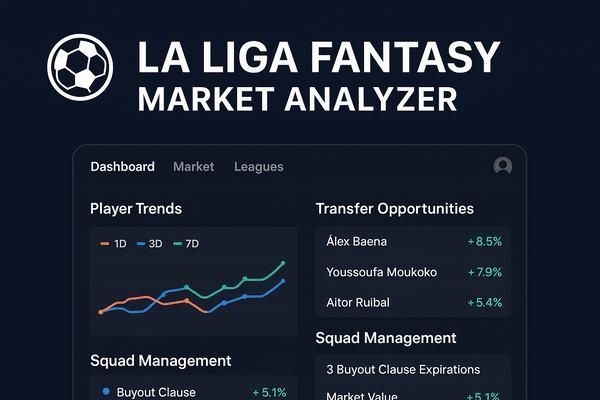

# ⚽ La Liga Fantasy Analyzer

## 🇬🇧 English

A comprehensive analytics tool designed for La Liga Fantasy football managers who want to gain a competitive edge. This modern web application provides deep market intelligence, advanced player analysis, and smart transfer opportunity detection to help you build the ultimate fantasy team.

**Key Benefits:**
- 📊 **Smart Analytics**: Multi-timeframe trend analysis and momentum scoring
- 🎯 **Transfer Intelligence**: Discover undervalued players with expiring protection periods
- 🔒 **Privacy-First**: All data processing happens client-side - your credentials never leave your browser
- ⚡ **Real-Time Data**: Live market values and player statistics

## 🇪🇸 Español

Una herramienta de análisis integral diseñada para managers de La Liga Fantasy que buscan obtener una ventaja competitiva. Esta moderna aplicación web proporciona inteligencia de mercado profunda, análisis avanzado de jugadores y detección inteligente de oportunidades de traspaso para ayudarte a construir el equipo fantasy definitivo.

**Beneficios Clave:**
- 📊 **Análisis Inteligente**: Análisis de tendencias multi-temporales y puntuación de momentum
- 🎯 **Inteligencia de Traspasos**: Descubre jugadores infravalorados con períodos de protección próximos a expirar
- 🔒 **Privacidad Primero**: Todo el procesamiento de datos ocurre en el cliente - tus credenciales nunca salen de tu navegador
- ⚡ **Datos en Tiempo Real**: Valores de mercado en vivo y estadísticas de jugadores



## 🚀 Features

### 🔐 Authentication & Security
- Secure authentication with La Liga Fantasy credentials
- JWT token management with automatic expiration handling
- Client-side processing - no data stored externally
- Authentication guards protecting all routes

### 📊 Advanced Player Analytics
- **Multi-timeframe Trends**: Track 1, 3, and 7-day market value changes
- **Momentum Scoring**: Proprietary algorithm analyzing player value trajectories
- **Performance Metrics**: Points, averages, and trend analysis
- **Opportunity Detection**: Smart algorithms to identify undervalued players

### 🎯 Market Intelligence
- **Transfer Opportunities**: Find players from other managers with:
    - Low buyout clauses (< 120% market value)
    - Expiring protection periods
    - Upward trending performance
    - Smart opportunity scoring
- **Official Market**: Browse players sold directly by La Liga teams
- **Squad Management**: Monitor your current players with alerts for:
    - Buyout clause protection expiration
    - Market value changes
    - Players on sale with time tracking

### 🏆 League Management
- Multi-league dashboard with quick access
- League statistics and team overview
- Cross-league player comparison

## 🏃‍♂️ Getting Started

### Prerequisites
- Node.js 18+ and pnpm
- La Liga Fantasy account

### Installation

1. **Clone the repository**:
```bash
git clone https://github.com/sergioalmela/liga-fantasy-market-analyzer.git
cd la-liga-fantasy-analyzer
```

2. **Install dependencies**:
```bash
pnpm install
```

3. **Start development server**:
```bash
pnpm dev
```

4. **Open your browser**:
   Navigate to [http://localhost:3000](http://localhost:3000)

### Usage

1. **Login** with your La Liga Fantasy credentials
2. **Select your league** from the dashboard
3. **Analyze opportunities** to find undervalued players
4. **Monitor your squad** with trend analysis
5. **Browse the market** for direct purchases

---

## 🛠️ Technical Information

### Technology Stack

#### Core Framework
- **Next.js 15** - Latest version with App Router and Turbopack
- **React 19** - Latest React features and optimizations
- **TypeScript 5** - Full type safety with strict configuration

#### Architecture
- **Clean Layered Architecture** - Separation of concerns with:
    - Domain entities and business logic
    - Service layer for API integration
    - Presentation layer with reusable components
    - Infrastructure utilities and mappers

#### Styling & UI
- **Tailwind CSS 4** - Modern utility-first styling
- **Lucide React** - Beautiful icon library
- **Custom UI Components** - Consistent design system
- **Responsive Design** - Mobile-first approach

#### Code Quality
- **Biome** - Modern linter and formatter
- **Strict TypeScript** - Comprehensive type checking

### Project Structure

```
src/
├── app/                    # Next.js app router pages
│   ├── leagues/           # League-specific routes
│   ├── login/             # Authentication
│   └── api/               # API proxy routes
├── components/            # Reusable UI components
│   ├── auth/              # Authentication components
│   ├── layout/            # Layout components
│   ├── player/            # Player-specific components
│   └── ui/                # Base UI components
├── entities/              # Domain models
├── services/              # Business logic layer
├── mappers/               # Data transformation
├── utils/                 # Utility functions
└── lib/                   # Core utilities and API
```

### Development

#### Available Scripts

- `pnpm dev` - Start development server with Turbopack
- `pnpm build` - Build for production
- `pnpm start` - Start production server
- `pnpm lint` - Run Biome linter and formatter

#### API Integration

The application integrates with La Liga Fantasy through:
- **Authentication**: OAuth2 flow with JWT tokens
- **Data Fetching**: RESTful API calls for players, leagues, and market data
- **Proxy Layer**: Next.js API routes for secure communication
- **Real-time Updates**: Live market values and player statistics

### Analytics Algorithm

#### Opportunity Scoring
Our proprietary algorithm evaluates players based on:

1. **Buyout Opportunities** (40+ points): Players with low buyout clauses
2. **Market Value** (0-20 points): Normalized player value importance
3. **Momentum Trends** (±15 points): Recent performance trajectory
4. **Points Performance** (0-10 points): Statistical performance
5. **Sale Urgency** (0-5 points): Time-sensitive opportunities

#### Trend Analysis
- Multi-timeframe price tracking (1d, 3d, 7d)
- Momentum calculation with weighted scoring
- Performance correlation with market movements

### Deployment

#### Building for Production
```bash
pnpm build
pnpm start
```

The application can be deployed to any platform supporting Next.js:
- Vercel (recommended)
- Netlify
- Railway
- Self-hosted

### Contributing

1. Fork the repository
2. Create a feature branch: `git checkout -b feature/amazing-feature`
3. Commit your changes: `git commit -m 'Add amazing feature'`
4. Push to the branch: `git push origin feature/amazing-feature`
5. Open a Pull Request

## ⚠️ Disclaimer

This is an unofficial tool created for educational and analytical purposes. It is not affiliated with La Liga or their fantasy platform. Please respect La Liga Fantasy's terms of service when using this application.

---

**Happy analyzing! ⚽📈**